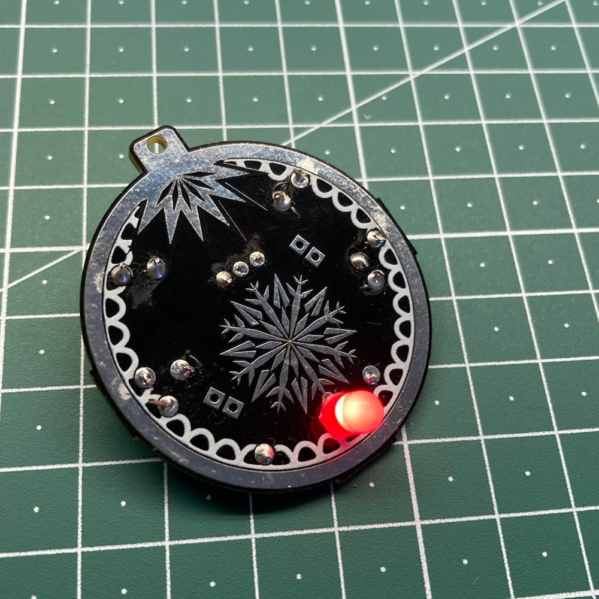
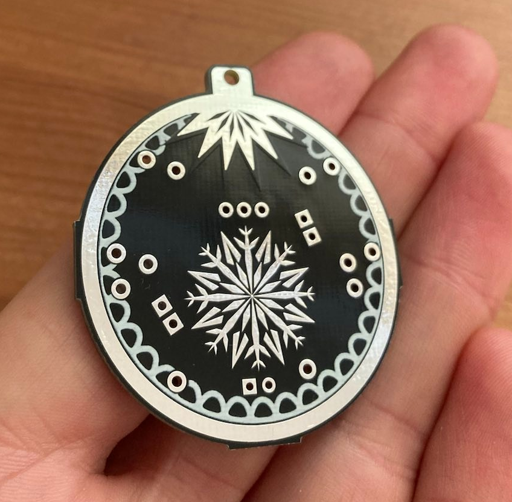
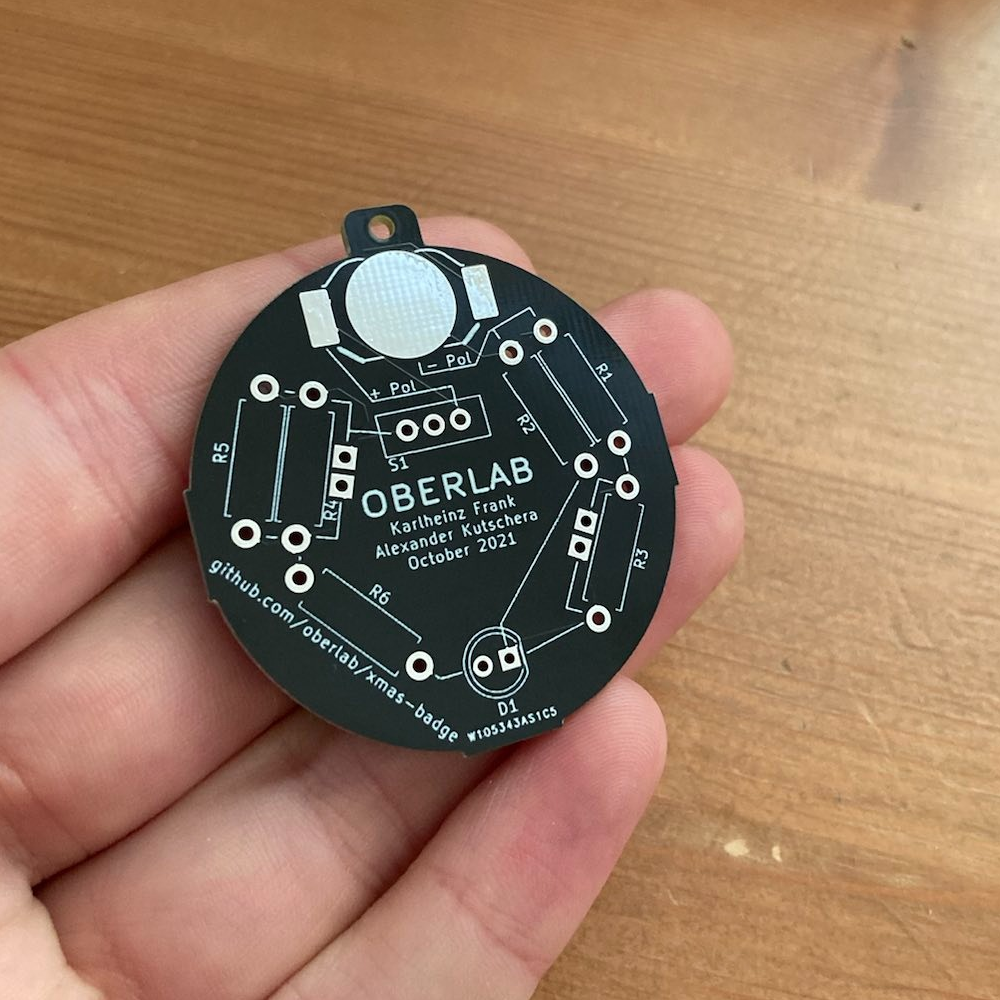

<h1 align="center">XMas LED Badge (educational PCB)</h1>
<h3 align="center">Christmas decoration for maker</h3>

 
 

## Instructions
We used this PCB as part of an educational workshop about electronics. The instructions and exercises for the students are in the folder edu_resources. Unfortunately they are just available in German for now. Feel free to translate them and file a pull-request.

## Parts
You can find a list of the required parts in the 1-click-BOM.csv file. It lists all the respective products at part resellers. However, for some standard parts such as the 5 mm LEDs and the switches you might want to consider buying them in bulk from another supplier because it'll be much cheaper. Here are some links:
- [slider switch](https://de.aliexpress.com/item/4000091720006.html)
- [CR1225 battery clip](https://de.aliexpress.com/item/4000273116875.html)

## About & Attribution

### PCB Design
The PCB was designed using [KiCAD](https://www.kicad.org/) in combination with the [svg2shenzhen plugin](https://github.com/badgeek/svg2shenzhen) for [Inkscape](https://inkscape.org/). A big thank you to [badgeek](https://github.com/badgeek) for developing and maintaining this awesome piece of software which got me into PCB designe in the first place

### PCB manufacturing
PCBs were manufactured by [PCBWay](https://www.pcbway.com/) (sponsored). Order process was very simple, customer service friendly and the quality of the PCBs is great! Thanks to PCBWay for sponsoring this project and thus made our christmas workshop with local students possible.

## License
The PCB is licenced under the CERN-OHL-W license and everything else (README, instructions and templates) under CC-BY-SA 4.0
